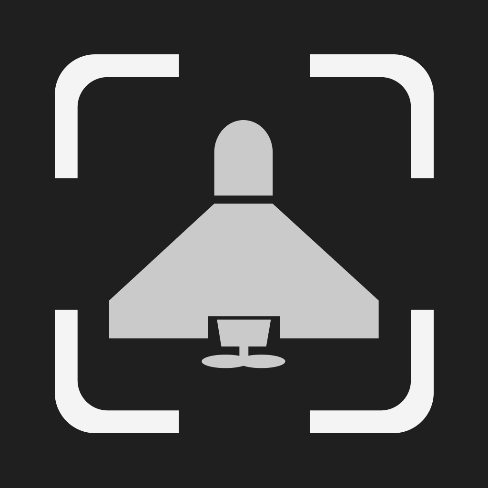
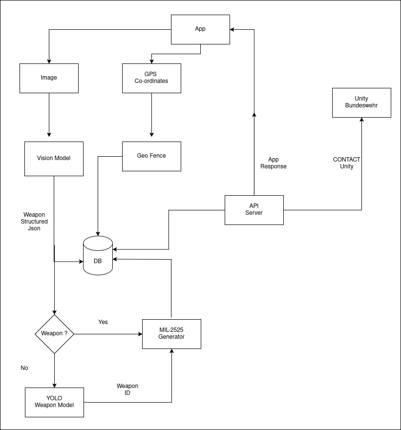

# Thunder Flash

- Weapons Identification App for Civilians to report suspicious objects and Management platform for authorities for issue resolution

- Presentation [PPT](docs/weapon-watch.pdf)  

- Dual Use - [Delivery Tracking Platform](docs/dual_use/delivery_tracking.md)

- Deployment [doc](docs/deployment.md) 

- CIHBw-4	Bomb-Lense	 - [challenge](challenge.md)

- App Video - [Demo](https://youtube.com/shorts/8qMi7JiIdeM?feature=share) - 

- System Diagram
    - 

- Entity Relationshop Model - [document](docs/database-er-design.md)
    
- Tasks
    - [Stage 1](docs/tasks-v1.md) : 1pm Nov 13 - 1pm Nov 14
    - [Stage 2](docs/tasks-day2.md) : 1pm Nov 14 - 1pm Nov 15
    - [Stage 3](docs/tasks-day-3.md) : 1pm Nov 15 - 9am Nov 16

- TODO
  - [Nov 2025 - v2](docs/ver_2/todo.md)

- Idea - [v1-doc](docs/ideas-v1.md)

- Video Edit [Script](docs/video-edit.md)